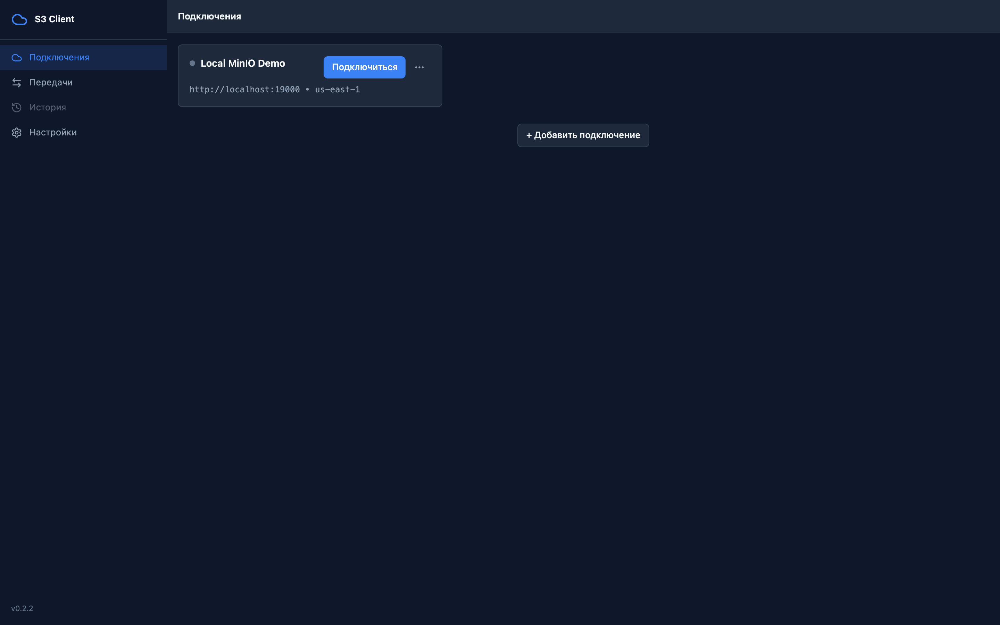
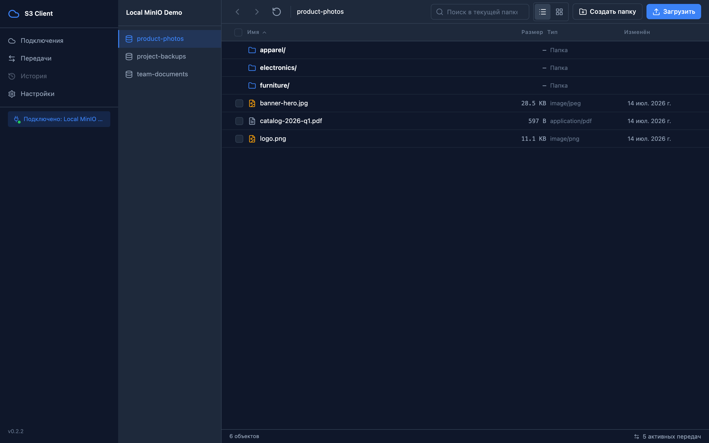
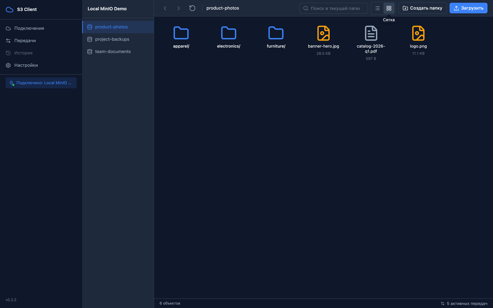
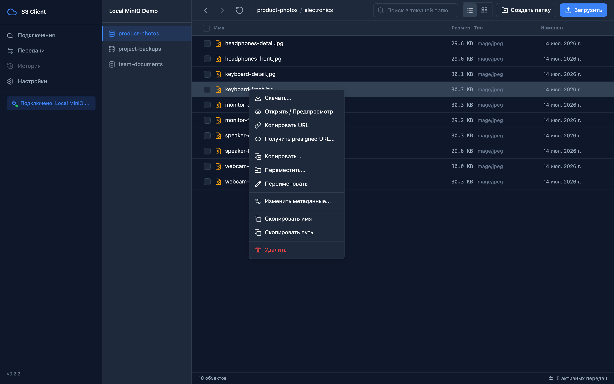
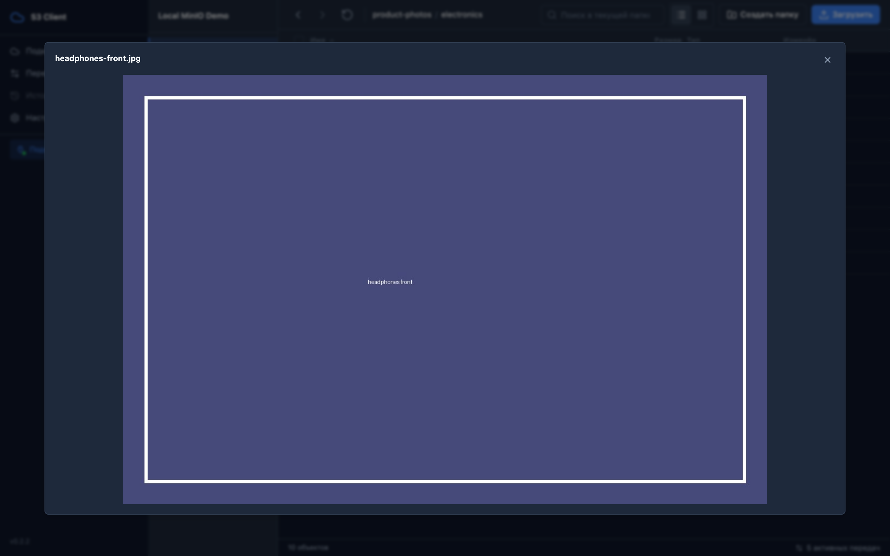
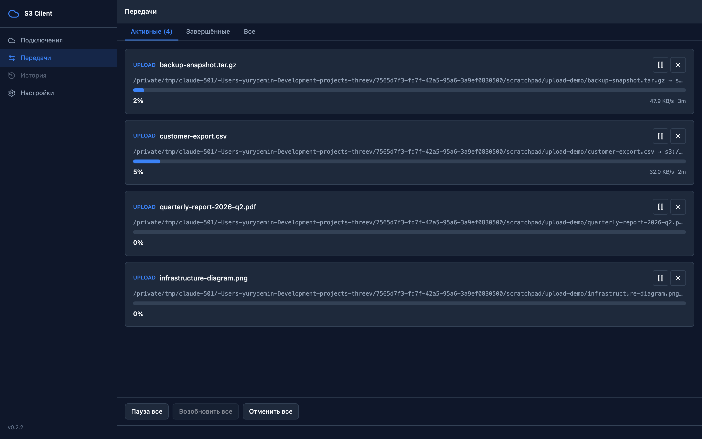
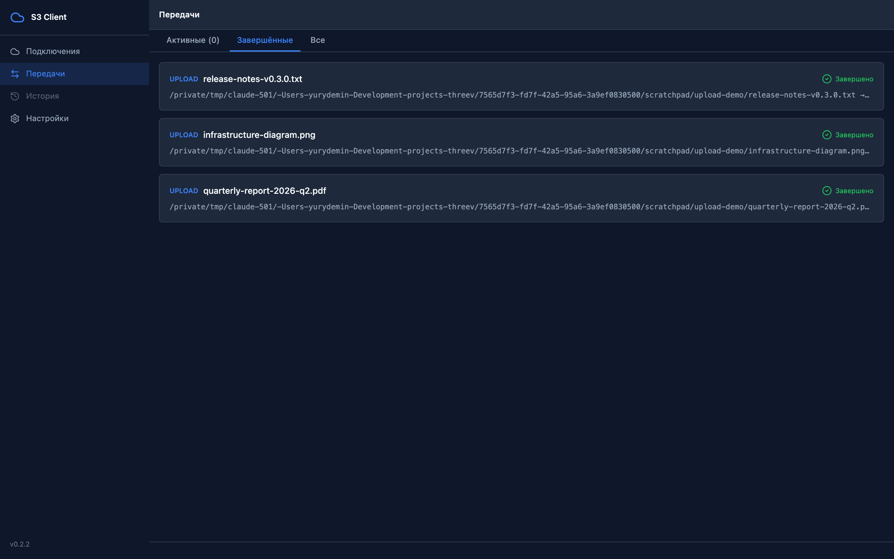
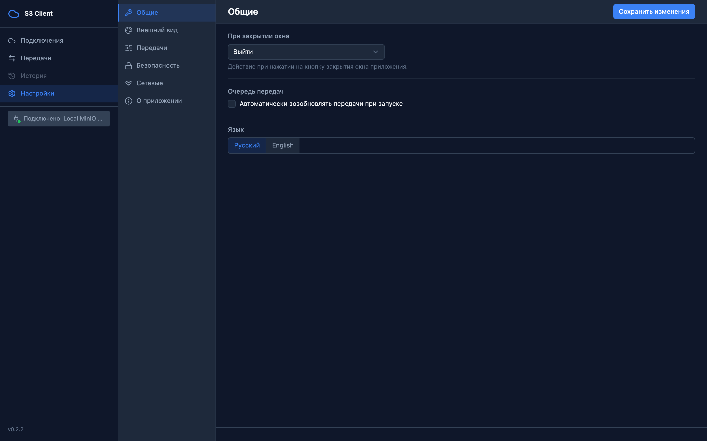

# threev

Кроссплатформенный десктопный клиент для S3-совместимых хранилищ (AWS S3, MinIO и другие) — быстрая работа с бакетами и файлами без браузерной консоли.

## Возможности

- Несколько подключений с шифрованием credentials (AES-256-GCM), опционально — под мастер-паролем
- Файловый менеджер: навигация по бакетам/папкам, поиск, сортировка, предпросмотр изображений/PDF/текста
- Загрузка и скачивание с multipart/range, устойчивостью к обрывам сети и возобновлением
- Массовые операции: удаление, копирование, перемещение
- Presigned URL, метаданные объектов, создание папок
- Тёмная/светлая тема, масштаб интерфейса, горячие клавиши
- Локализация: русский и английский

## Скриншоты

| | |
|---|---|
|  Подключения |  Файловый менеджер |
|  Вид сеткой |  Контекстное меню объекта |
|  Предпросмотр изображения |  Активные передачи |
|  История передач |  Настройки |

## Стек

Go 1.25 + [Wails v2](https://wails.io/) (нативный WebView) · React 19 + TypeScript · Zustand · Tailwind CSS · SQLite · AWS SDK for Go v2

## Установка

Готовые сборки для macOS, Windows и Linux — на странице [Releases](https://github.com/yurydemin/threev/releases). Инсталляторы не подписаны сертификатом разработчика — при первом запуске macOS/Windows покажут предупреждение (Gatekeeper/SmartScreen).

Сборка из исходников и архитектура проекта — см. [ARCHITECTURE.md](ARCHITECTURE.md).

## Статус

Активно развивается, релизы публикуются по мере готовности (текущая версия — см. [Releases](https://github.com/yurydemin/threev/releases)). Список известных ограничений и запланированных доработок — [docs/backlog.md](docs/backlog.md).

## Лицензия

[MIT](LICENSE)
