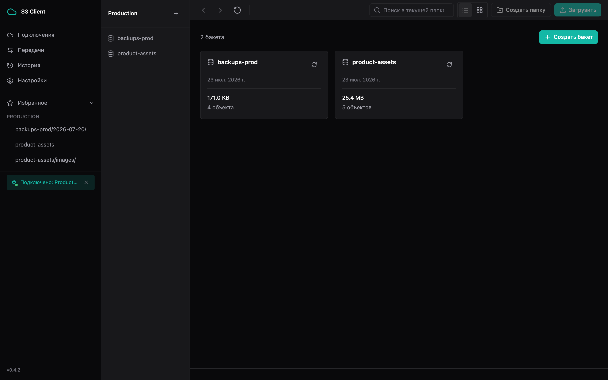
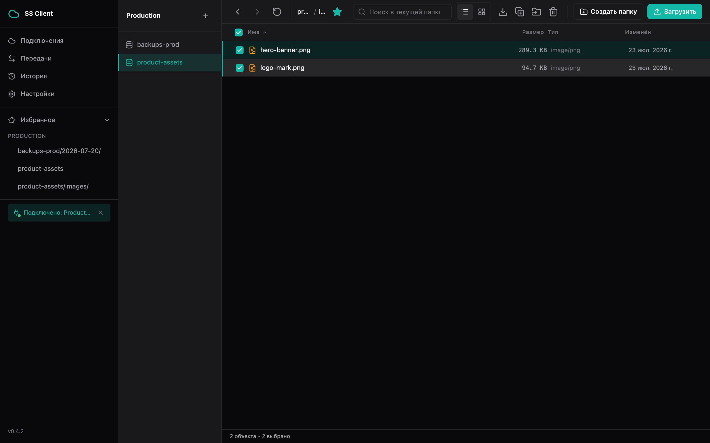
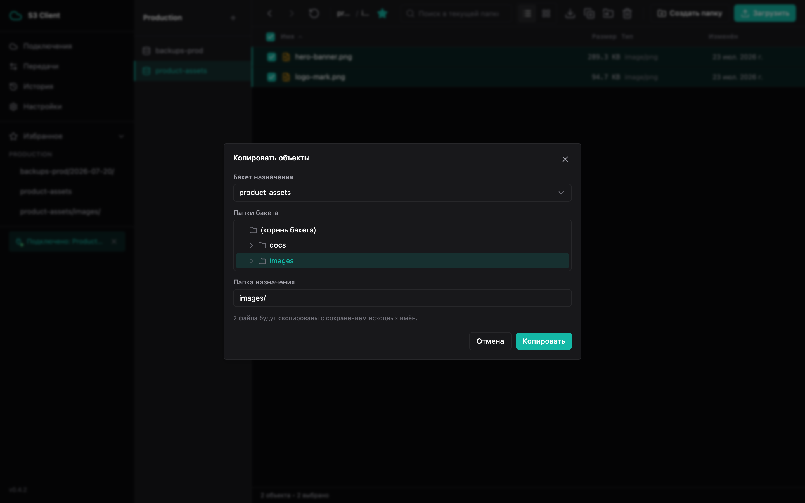
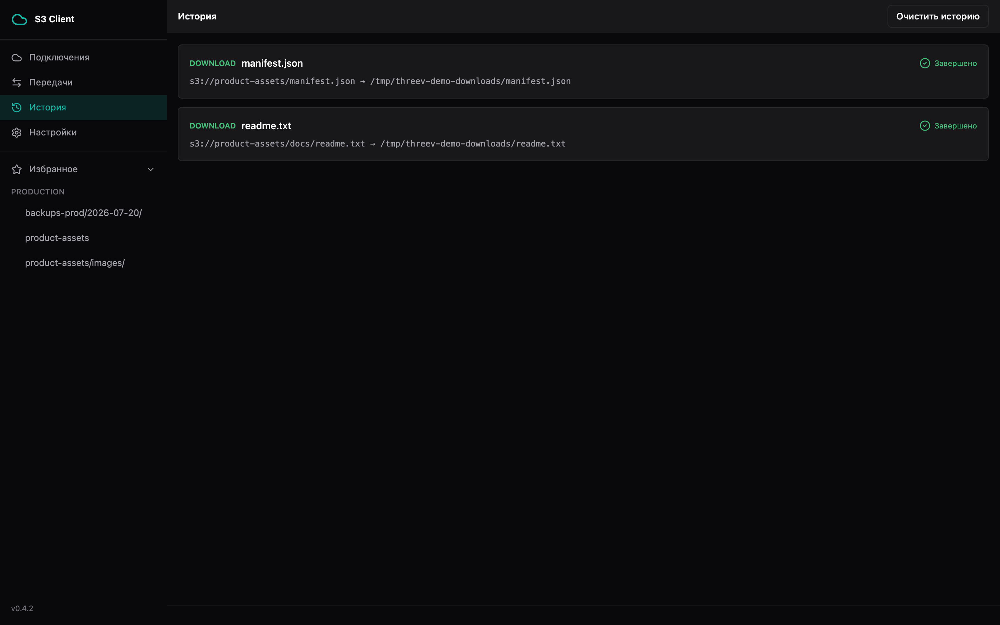
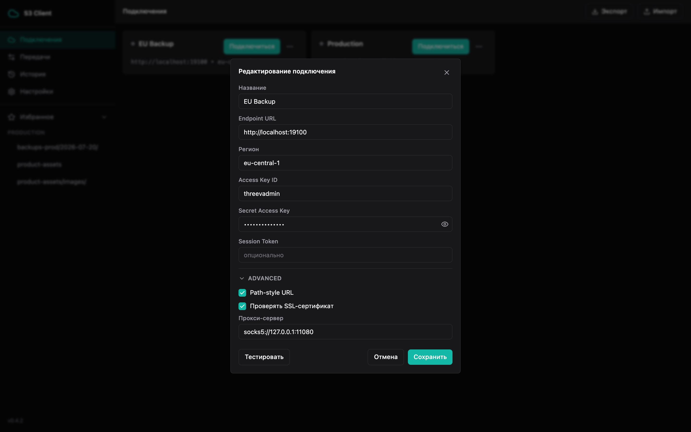

# threev

Кроссплатформенный десктопный клиент для S3-совместимых хранилищ (AWS S3, MinIO и другие) — быстрая работа с бакетами и файлами без браузерной консоли.

## Возможности

- Сохранение нескольких подключений (профилей), переключение между ними; credentials зашифрованы (AES-256-GCM), опционально — под мастер-паролем; экспорт/импорт профилей между машинами без передачи секретов
- Файловый менеджер: навигация по бакетам/папкам, сортировка, клиентский поиск в текущей папке и рекурсивный поиск по всему бакету; создание и удаление бакетов
- Дашборд бакета — агрегированный размер и количество объектов по требованию
- Избранное — закладки на часто используемые бакеты/папки, доступны из сайдбара на любом экране, с быстрым переключением между подключениями
- Предпросмотр изображений, PDF, текста и видео прямо в приложении
- Загрузка и скачивание с multipart/range, устойчивостью к обрывам сети и возобновлением; настраиваемое число попыток и таймаут соединения
- Скачивание папки единым ZIP-архивом — альтернатива развёрнутому скачиванию по файлам
- Массовые операции: удаление, копирование, перемещение (включая объекты свыше 5 ГБ через серверный multipart-copy) с выбором места назначения через дерево папок
- Очередь передач с паузой/отменой и отдельный экран «История» завершённых передач
- Presigned URL, метаданные объектов, создание папок
- Тёмная/светлая тема, масштаб интерфейса, горячие клавиши
- Локализация: русский и английский

## Скриншоты

| | |
|---|---|
|  Подключения и избранное |  Дашборд бакетов с размером |
|  Файловый менеджер |  Вид сеткой |
|  Контекстное меню объекта |  Массовый выбор и действия |
|  Копирование — дерево папок назначения |  Предпросмотр изображения |
|  Активная передача с прогрессом |  История передач |
|  Настройки: retry/timeout/скорость |  HTTP/SOCKS5-прокси в форме подключения |

## Стек

Go 1.25 + [Wails v2](https://wails.io/) (нативный WebView) · React 19 + TypeScript · Zustand · Tailwind CSS · SQLite · AWS SDK for Go v2

## Установка

Готовые сборки для macOS, Windows и Linux — на странице [Releases](https://github.com/yurydemin/threev/releases). Инсталляторы не подписаны сертификатом разработчика — при первом запуске macOS/Windows покажут предупреждение (Gatekeeper/SmartScreen).

Сборка из исходников и архитектура проекта — см. [ARCHITECTURE.md](ARCHITECTURE.md).

## Статус

Активно развивается, релизы публикуются по мере готовности (текущая версия — см. [Releases](https://github.com/yurydemin/threev/releases)). Список известных ограничений и запланированных доработок — [docs/backlog.md](docs/backlog.md).

## Лицензия

[MIT](LICENSE)
